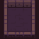
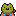
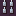
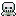
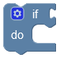
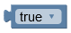
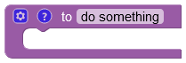
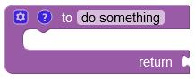

# Game Design Document - CodeHop

# Specifications
## Concept
The aim of CodeHop is to learn basic programming through puzzle solving. 

## Platform
The game is aimed to be played in a web platform, but due to the nature of the project, it can be played offline and on other devices.

## Game Structure
The game is divided into 2 sections, a level player and a level editor (level creator).

### Level Player
The level player is used to play either offical levels or community-created levels. The screen is divided into a programming zone, where the where the player interacts with the "code blocks", and the level "board", where the result of the code is animated once the code is executed.

#### Objective
The objective of the game is to make each player character reach the chest with matching colors, without any of them losing in the process.
A player loss is caused when:
1. There are no more instructions to run and any player hasn't reached their respective chest, or
2. Any player avatar has died, such as by touching spikes or skeletons, or
3. A timeout is triggered (due to infinite loop or other conditions).

#### Board Zone
The board is based on a square grid of size 15 > x, y > 2.
The playing area defined by the background may not be square.

##### Objects

|    Name    | Sprite                                                          |                                Description                               |
|------------|:---------------------------------------------------------------:|--------------------------------------------------------------------------|
| Background |  | Wall tiles have colliders, other background tiles are purely decoration. |
|   Player   |          | Character controlled by the user.                                        |
|  Objective |        | If all player characters reach their respective chest, they win.         |
|    Trap    |              | If a player touches a trap, they lose.                                   |
|    Wall    |              | Collision object.                                                        |
|    Enemy   |            | If a player touches an enemy, they lose. Enemies move in a pattern.      |

#### Programming Zone
The programming zone has a toolbox of available blocks and a workspace to place the blocks to be used. Some levels may not have all blocks available in the toolbox to limit difficulty or to practice a specific skill. To use a block the user can drag a block from the toolbox and drop it in the workspace.

The workspace will always have a single, un-deletable "start" block. When the user selects "Run code", all blocks connected to the "start" block will be sequentially executed.

Available Blocks

#### Actions
|  Name  |                     Sprite                    |                                                 Description                                                |
|--------|:---------------------------------------------:|:----------------------------------------------------------------------------------------------------------:|
| Move   |      | Moves the player character NUMBER blocks in DIRECTION, where NUMBER and DIRECTION are specified variables. |
| Rotate |  | Rotates the player character clockwise or counter-clockwise once.                                          |

#### Logic
|        Name       |                                   Sprite                                  |                               Description                              |
|-------------------|:-------------------------------------------------------------------------:|-----------------------------------------------------------------------|
| Conditionals      |            | If, else if, and else block. Allows for conditional execution of code. |
| Equality          |                    | Comparison block. Allows =, !=, <, <=, etc...                          |
| Logical Operators |  | Allows for extended comparisons. Allows AND, OR.                       |
| Negation          |                    | Negates a boolean value.                                               |
| Booleans          |                    | True or False.                                                         |

#### Functions
|        Name        |                                        Sprite                                        |                                 Description                                 |
|--------------------|:------------------------------------------------------------------------------------:|-----------------------------------------------------------------------------|
| Function           |                               | Creates a function that can be used repeatedly or from another code branch. |
| Return Function    |                 | Creates a function that returns a value.                                    |
| Conditional Return |  | Allows for conditional returns in functions.                                |

### Level Editor
The Level Editor allows users to create levels and upload them to the community once completed. The screen is divided into a sprite selector and an empty board. The sprite selector has 2 tabs, a background sprite selector and a game object selector.

#### Actions
##### Add object to level
Users can drag and drop both background and game object sprites from the selector to the board to add them to the level.

##### Change board size
Users can add or remove rows and columns to make the board smaller or larger.

##### Test Level
Users can play the level to see if it's completabale. If it's not completabale they can continue editing it.

##### Upload Level
Users can save and publish the level to the community or specific users/groups once it's been successfully tested.

## Graphics
The graphics are implemented through Phaser's built-in arcade graphics engine, which allows for webGL rendering of most of our game assets.

## Data storage
To store data we use a relational database management system (rdbms) called MySQL. It accomplishes all our needs, even storing levels in a JSON format.